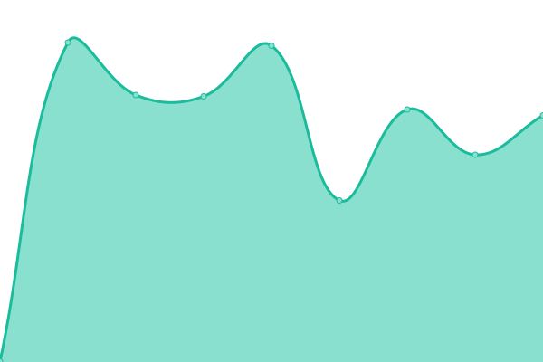

# [📈 Live Status](https://status.whipcode.app): <!--live status--> **🟧 Partial outage**

This repository contains the open-source uptime monitor and status page for [Whipcode-API](https://status.whipcode.app), powered by [Upptime](https://github.com/upptime/upptime).

With [Upptime](https://upptime.js.org), you can get your own unlimited and free uptime monitor and status page, powered entirely by a GitHub repository. We use [Issues](https://github.com/Whipcode-API/upptime/issues) as incident reports, [Actions](https://github.com/Whipcode-API/upptime/actions) as uptime monitors, and [Pages](https://status.whipcode.app) for the status page.

<!--start: status pages-->
<!-- This summary is generated by Upptime (https://github.com/upptime/upptime) -->
<!-- Do not edit this manually, your changes will be overwritten -->
<!-- prettier-ignore -->
| URL | Status | History | Response Time | Uptime |
| --- | ------ | ------- | ------------- | ------ |
|  Whipcode API | 🟥 Down | [whipcode-api.yml](https://github.com/Whipcode-API/upptime/commits/HEAD/history/whipcode-api.yml) | 

 579ms
     
 | 

<a href="https://status.whipcode.app/history/whipcode-api">100.00%</a>
    

|  [Whipcode Site](https://whipcode.app) | 🟩 Up | [whipcode-site.yml](https://github.com/Whipcode-API/upptime/commits/HEAD/history/whipcode-site.yml) | 

 89ms
     
 | 

<a href="https://status.whipcode.app/history/whipcode-site">100.00%</a>
    

|  [RapidAPI Proxy](https://whipcode.p.rapidapi.com) | 🟩 Up | [rapid-api-proxy.yml](https://github.com/Whipcode-API/upptime/commits/HEAD/history/rapid-api-proxy.yml) | 

 1324ms
     
 | 

<a href="https://status.whipcode.app/history/rapid-api-proxy">100.00%</a>
    

<!--end: status pages-->

[**Visit our status website →**](https://status.whipcode.app)

## 📄 License

- Powered by: [Upptime](https://github.com/upptime/upptime)
- Code: [MIT](./LICENSE) © [Whipcode-API](https://status.whipcode.app)
- Data in the `./history` directory: [Open Database License](https://opendatacommons.org/licenses/odbl/1-0/)
